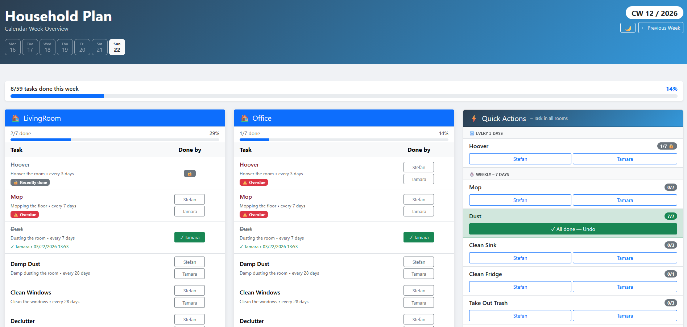

# Household Task Checklist


A web-based household task manager built with Flask. It organises cleaning and maintenance tasks by room and calendar week, tracks who completed what, and highlights overdue or recently completed tasks.

---

## Features

- **Weekly task overview** — All tasks are grouped by room and displayed per calendar week (ISO week numbering).
- **Task completion** — Mark individual tasks as done and assign them to a household member. The timestamp is recorded automatically.
- **Overdue detection** — A task is flagged as overdue when more than one full repeat cycle has passed without it being done (e.g. a 7-day task untouched for 2+ weeks).
- **Locked tasks** — Tasks completed within their repeat window are shown as *Recently done* to prevent duplicate entries.
- **History navigation** — Browse past weeks in read-only mode; up to 40 weeks are retained in memory.
- **Quick Actions** — Complete a recurring task (e.g. *Vacuum*) across all rooms in a single click.
- **Progress tracking** — A progress bar and counter show how many tasks have been completed in the current week.
- **Multilingual UI** — The interface supports English (`en`) and German (`de`), configurable per household.
- **Debug mode** — Automatically populates five previous weeks with randomly completed tasks for testing and development.

---

## Screenshots



---

## Project Structure

```
Household_Task_Checklist/
├── app.py                  # Flask app factory, routes, overdue/locked logic
├── scheduler.py            # Week creation, history management, debug data
├── config.conf             # Main configuration file (users, rooms, tasks)
├── Requirements.txt        # Python dependencies
├── Dockerfile              # Multi-stage Docker build
├── docker-compose.yml      # Compose configuration
├── frontend/
│   └── index.html          # Jinja2 template (UI)
├── setup/
│   └── setup_venv.py       # Virtual environment setup helper
└── src/
    ├── room.py             # Room model
    ├── task.py             # Task model
    ├── week.py             # Week model
    ├── logger.py           # Logging helper
    └── setup/
        └── config.py       # Config parser (reads config.conf)
```

---

## Configuration (`config.conf`)

All household-specific settings live in a single INI-style file at the project root.

### `[Users]`
Comma-separated list of household members. These names appear in the *Done by* dropdown.

```ini
[Users]
names = Stefan, Tamara
```

### `[Settings]`
| Key           | Values        | Description                                                      |
|---------------|---------------|------------------------------------------------------------------|
| `languageKey` | `en` \| `de`  | UI language. Defaults to `en` if an invalid value is provided.  |
| `debug`       | `True` \| `False` | Enables debug mode (generates 5 fake past weeks on startup). |

```ini
[Settings]
languageKey = en
debug       = False
```

### `[Room:<Name>]`
Defines a room and assigns tasks to it by referencing task keys defined below.  
The display name in the UI is derived from the section suffix (e.g. `LivingRoom`).

```ini
[Room:LivingRoom]
tasks = Hoover, Mop, Dust, CleanWindows
```

Multiple rooms can be defined. Each room section creates an independent copy of the listed tasks.

### `[Task:<Key>]`
Defines a reusable task. Each task block has three fields:

| Field         | Type    | Description                                                                 |
|---------------|---------|-----------------------------------------------------------------------------|
| `name`        | string  | Display name shown in the UI.                                               |
| `repeat`      | integer | How often the task should be done, **in days** (e.g. `7` = weekly, `28` = monthly). |
| `description` | string  | Short description (shown as tooltip or detail text).                        |

```ini
[Task:Hoover]
name        = Hoover
repeat      = 7
description = Vacuum the room

[Task:CleanWindows]
name        = Clean Windows
repeat      = 28
description = Clean the windows
```

> **Tip:** A task referenced in a `[Room]` section must have a matching `[Task:<Key>]` block, otherwise the config parser will raise an error.

---

## Setup

### Option 1 — Virtual Environment (local)

**Prerequisites:** Python 3.14

```bash
# Create and activate the virtual environment
python setup/setup_venv.py

# Windows
.venv\Scripts\activate

# Linux / macOS
source .venv/bin/activate

# Install dependencies
pip install -r Requirements.txt

# Run the app
python app.py
```

The app starts on **http://localhost:5000** by default.

### Option 2 — Docker

**Prerequisites:** Docker & Docker Compose

```bash
# Build and start the container
docker compose up --build
```

The `docker-compose.yml` restarts the container automatically (`unless-stopped`).  
To expose the app on a host port, uncomment and adjust the `ports` section in `docker-compose.yml`:

```yaml
ports:
  - "5000:5000"
```

The Docker image uses a **multi-stage build** (builder + slim runtime) and runs the application as a **non-root user** for security.

### Option 3 — Raspberry Pi (systemd service)

**Prerequisites:** Raspberry Pi OS (or any Debian-based Linux), Python 3.14

This setup creates a systemd service that starts the application automatically on boot.

```bash
# Clone the repository (or copy files to your Pi)
cd /home/pi
git clone https://github.com/yourusername/Household_Task_Checklist.git
cd Household_Task_Checklist

# Create and activate virtual environment
python3 -m venv .venv
source .venv/bin/activate

# Install dependencies
pip install -r Requirements.txt
deactivate
```

**Create a systemd service file:**

```bash
sudo nano /etc/systemd/system/household-tasks.service
```

Paste the following configuration (adjust paths and user if needed):

```ini
[Unit]
Description=Household Task Checklist Web Service
After=network.target

[Service]
Type=simple
User=pi
WorkingDirectory=/home/pi/Household_Task_Checklist
Environment="PATH=/home/pi/Household_Task_Checklist/.venv/bin"
ExecStart=/home/pi/Household_Task_Checklist/.venv/bin/python app.py
Restart=always
RestartSec=10

[Install]
WantedBy=multi-user.target
```

**Enable and start the service:**

```bash
# Reload systemd daemon
sudo systemctl daemon-reload

# Enable service to start on boot
sudo systemctl enable household-tasks.service

# Start the service now
sudo systemctl start household-tasks.service

# Check service status
sudo systemctl status household-tasks.service
```

**Useful commands:**

```bash
# View logs
sudo journalctl -u household-tasks.service -f

# Restart the service
sudo systemctl restart household-tasks.service

# Stop the service
sudo systemctl stop household-tasks.service

# Disable auto-start
sudo systemctl disable household-tasks.service
```

The app will be accessible at **http://<raspberry-pi-ip>:5000**. To find your Pi's IP address, run `hostname -I`.

---

## API Endpoints

| Method | Route                    | Description                          |
|--------|--------------------------|--------------------------------------|
| `GET`  | `/`                      | Current week view                    |
| `GET`  | `/week/<year>/<week_no>` | Past week view (read-only)           |
| `POST` | `/api/task/complete`     | Mark a task as done                  |
| `POST` | `/api/task/uncomplete`   | Undo task completion                 |

### `POST /api/task/complete`
```json
{
  "room":   "Kitchen",
  "task":   "Hoover",
  "doneBy": "Stefan"
}
```

### `POST /api/task/uncomplete`
```json
{
  "room": "Kitchen",
  "task": "Hoover"
}
```

---

## License

This project is licensed under the [MIT License](LICENSE).